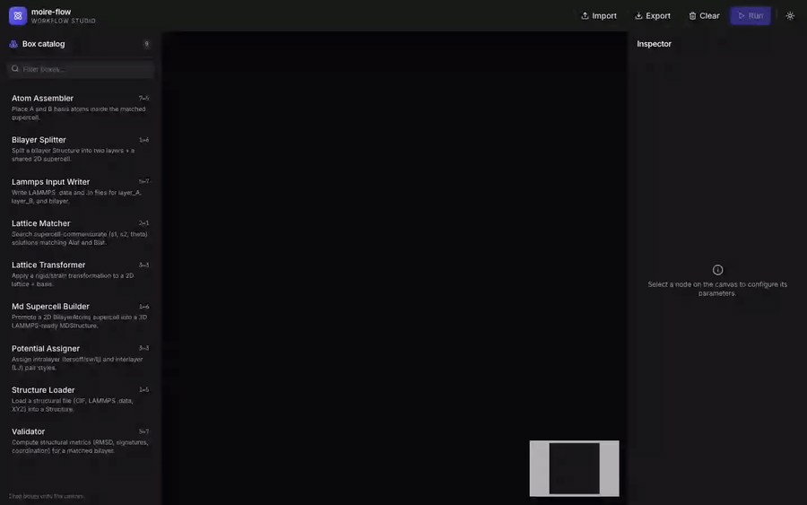

# moire-flow

A modular workflow engine for **moire lattice matching** and **LAMMPS
molecular-dynamics setup**. Pick two 2D materials, find the supercell that
commensurates them under strain + rotation, build the bilayer atoms, write
LAMMPS-ready input, and inspect the result — either from Python, the CLI,
or a visual studio in the browser.

This is the software backing the AI4AM 2026 abstract
[*Evaluation of Foundation Models for van der Waals Heterostructure Moirè Supercells*](https://phantomsfoundation.com/AI4AM/2026/Abstracts/AI4AM2026_Cuccurullo_Susi_176.pdf)
(Cuccurullo, Chacón Sartori, Franco, Roche, García — ICN2, Barcelona).
It refactors the original 12 164-line Colab notebook
(`reference/lattice_matching_02032026.py`) into nine typed,
JSON-serializable boxes plus a DAG executor. Logic equivalence with the
original is verified by 37 regression tests — see [VALIDATION.md](VALIDATION.md).



The end result of a moire-flow workflow is a relaxed bilayer that can be
inspected atom by atom and pair-style by pair-style:

https://github.com/camilochs/moire-flow/raw/refs/heads/main/web/docs/particles.mp4

## What it does

Given two 2D lattices (e.g. MoSe₂ on HfSe₂):

1. **StructureLoader** — read CIF, LAMMPS `.data`, or XYZ files
2. **BilayerSplitter** — split a stacked bilayer into two single layers
3. **LatticeTransformer** — generate synthetic test cases (rotation, strain)
4. **LatticeMatcher** — search the (s₁, s₂, θ) space via DE or brute force
5. **AtomAssembler** — fill the matched supercell with atoms
6. **Validator** — symmetry-aware angular error, fractional RMSD, coordination match
7. **MDSupercellBuilder** — promote 2D → 3D triclinic cell with vacuum
8. **PotentialAssigner** — pick Tersoff / SW / **GAP/QUIP** / **MACE** / LJ pair styles per layer
9. **LammpsInputWriter** — emit `.data` + `.in` files ready for LAMMPS

Three supports (MaterialsDB client, LAMMPS Docker executor, trajectory
analyzer) complete the picture.

## Requirements

| Tool | Minimum version | Notes |
|---|---|---|
| Python | 3.11 | Managed via [uv](https://docs.astral.sh/uv/) |
| uv | latest | Python project manager — `brew install uv` or [install script](https://docs.astral.sh/uv/getting-started/installation/) |
| Node.js | 20+ | Only if you want the web studio |
| Docker | any | Only if you want to actually run LAMMPS (M7 runtime) |

## Install

```bash
git clone https://github.com/camilochs/moire-flow.git
cd moire-flow
uv sync                # installs Python deps into .venv
```

To install with the optional web extras:

```bash
uv sync --extra web    # adds fastapi + uvicorn
```

To install the frontend (for the studio):

```bash
cd web/frontend
npm install
```

## Usage

### CLI

```bash
# List all 9 registered boxes
uv run moire-flow list-boxes

# Print the JSON schemas for one box's inputs/params/outputs
uv run moire-flow describe lattice_matcher

# Execute a WorkflowSpec from a JSON file
uv run moire-flow run my_workflow.json --out results/
```

A minimal `my_workflow.json` that rotates a 2D lattice by 30° and recovers
the supercell:

```json
{
  "nodes": [
    {
      "id": "transform",
      "box_name": "lattice_transformer",
      "params": { "transform_type": "rotation", "theta_deg": 30.0 },
      "inputs": {
        "Alat": [[3.16, 0.0], [0.0, 3.16]],
        "basis_A": [[0.0, 0.0], [1.58, 1.58]],
        "species_A": ["Mo", "S"]
      }
    },
    {
      "id": "match",
      "box_name": "lattice_matcher",
      "params": { "method": "rotation_only", "N": 4, "theta_steps": 13 },
      "inputs": { "Alat": [[3.16, 0.0], [0.0, 3.16]] }
    }
  ],
  "edges": [
    { "from_node": "transform", "from_field": "Blat",
      "to_node": "match",     "to_field": "Blat" }
  ]
}
```

### Web Studio

Two terminals:

```bash
# Terminal 1 — FastAPI backend on port 8765
uv run uvicorn web.backend.server:app --reload --port 8765
```

```bash
# Terminal 2 — Vite dev server on port 5173
cd web/frontend
npm run dev
```

Then open <http://localhost:5173>. The studio supports:

- **Drag-and-drop** box catalog with text filter
- **Custom React Flow node** with per-field input/output handles
- **Schema-driven inspector** form (booleans, numbers, enums, JSON)
- **Light / dark theme** toggle (persisted to `localStorage`)
- **Import / Export** WorkflowSpec as JSON
- **Run** the workflow and see results inline in the inspector

See [`web/README.md`](web/README.md) for the backend + frontend internals.

### Python API

```python
import numpy as np
from moire_flow.engine import WorkflowEngine, WorkflowSpec, Node, Edge

ALAT = np.array([[3.16, 0.0], [0.0, 3.16]]).tolist()
BASIS = np.array([[0.0, 0.0], [1.58, 1.58]]).tolist()

spec = WorkflowSpec(
    nodes=[
        Node(id="transform",
             box_name="lattice_transformer",
             params={"transform_type": "rotation", "theta_deg": 30.0},
             inputs={"Alat": ALAT, "basis_A": BASIS, "species_A": ["Mo", "S"]}),
        Node(id="match",
             box_name="lattice_matcher",
             params={"method": "rotation_only", "N": 4, "theta_steps": 13},
             inputs={"Alat": ALAT}),
    ],
    edges=[Edge(from_node="transform", from_field="Blat",
                to_node="match",       to_field="Blat")],
)
results = WorkflowEngine().run(spec)
print(results["match"].solutions[0])
```

### Adding a new box

Subclass `Box`, declare three Pydantic schemas, and decorate with
`@register_box`. The CLI and the web studio pick it up automatically — no
catalog or frontend changes needed.

```python
from moire_flow.boxes import Box, register_box
from pydantic import BaseModel

class MyInputs(BaseModel):  ...
class MyParams(BaseModel):  ...
class MyOutput(BaseModel):  ...

@register_box
class MyBox(Box[MyInputs, MyParams, MyOutput]):
    name = "my_box"
    description = "What this box does."
    inputs_schema = MyInputs
    params_schema = MyParams
    outputs_schema = MyOutput
    def run(self, inputs, params): ...
```

## Testing

```bash
uv run pytest -q
```

Expected: 165 tests pass, including:

- **37 reference-regression tests** — every pure helper agrees numerically
  with the original notebook on the same inputs ([VALIDATION.md](VALIDATION.md)).
- **14 MLIP pair-style tests** — GAP/QUIP and MACE (`pair_style mace` and
  `pair_style mliap`) script writers and the PotentialAssigner kinds that
  drive them.
- **1 end-to-end LAMMPS smoke test** — only runs when the Docker image
  `moire-flow-runtime:latest` is built locally (otherwise it skips). It
  writes a 4-atom MoS₂ workflow, executes LAMMPS in the container, parses
  the resulting log, and asserts a finite final potential energy.

To enable the LAMMPS smoke test:

```bash
docker build -t moire-flow-runtime:latest runtime/
uv run pytest tests/test_lammps_e2e.py -v
```

## Project layout

```
moire-flow/
├── src/moire_flow/
│   ├── boxes/             — the 9 boxes
│   ├── core/              — types + math primitives (algebra2d, matching, validation_metrics)
│   ├── constants/         — UFF_LJ, Tersoff/SW registries
│   ├── engine/            — WorkflowSpec + WorkflowEngine (DAG executor)
│   ├── io/                — file readers/writers (CIF, LAMMPS .data, XYZ, LAMMPS scripts)
│   ├── supports/          — MaterialsDB, LammpsExecutor, TrajectoryAnalyzer
│   └── cli.py             — `moire-flow` CLI entry point
├── web/
│   ├── backend/server.py  — FastAPI app
│   ├── frontend/          — Vite + React + TypeScript + Tailwind + React Flow
│   └── docs/              — demo.mp4 + demo.gif
├── tests/                 — 150 tests (unit + regression + e2e)
├── reference/             — vendored original Colab script
├── spike/                 — M0 audit notebooks (dataflow, dedup, Docker decision)
├── runtime/               — Docker LAMMPS runtime (linux/amd64, to be built)
├── ANALYSIS.md            — annotated walk-through of the original
├── ARCHITECTURE.md        — 9-box + 3-support specification
├── VALIDATION.md          — proof of logic equivalence with the original
└── pyproject.toml         — uv + hatchling
```

## Milestone status

- ✅ **M0** — audits + spikes (`spike/`)
- ✅ **M1** — scaffold (`core/types.py`, Box ABC, StructureLoader, io adapters)
- ✅ **M2** — LatticeTransformer + Validator
- ✅ **M3** — LatticeMatcher (continuous DE, brute force, rotation only)
- ✅ **M4** — BilayerSplitter + AtomAssembler
- ✅ **M5** — MDSupercellBuilder
- ✅ **M6** — PotentialAssigner + LammpsInputWriter
- ✅ **M7** — MaterialsDB + LammpsExecutor + TrajectoryAnalyzer
- ✅ **M8** — WorkflowSpec + WorkflowEngine
- ✅ **M9** — visual workflow studio (FastAPI + React Flow, light/dark)
- ✅ **Docker runtime (minimal)** — `runtime/Dockerfile` based on `lammps/lammps:latest`,
  ships Tersoff + SW + LJ + KSPACE. Published as
  `ghcr.io/camilochs/moire-flow-runtime:latest`. End-to-end LAMMPS smoke test passes.
- ✅ **Docker runtime (full)** — `runtime/Dockerfile.full` source-compiles LAMMPS
  stable_29Aug2024 with ML-IAP + ML-MACE + ML-SNAP + Python + libtorch; ships
  `mace-torch` for the mliappy bridge. Published as
  `ghcr.io/camilochs/moire-flow-runtime:full` (~900 MB compressed). Smoke test
  validates `mliap` + `snap` pair styles are registered. Built on GitHub Actions
  native amd64 runners (the `:full` image cannot be reliably built under
  Rosetta/QEMU on Apple Silicon — see `runtime/README.md`).

## Citation

If you use moire-flow in research, please cite:

> Cuccurullo, S.; Chacón Sartori, C.; Franco, C.; Roche, S.; García, J. H.
> *Evaluation of Foundation Models for van der Waals Heterostructure Moirè
> Supercells*. AI4AM 2026, Madrid (Spain), 19–21 May 2026.
> [Abstract PDF](https://phantomsfoundation.com/AI4AM/2026/Abstracts/AI4AM2026_Cuccurullo_Susi_176.pdf)

The paper motivates a computational workflow for the systematic evaluation
of classical and machine-learned interatomic potentials (MLIPs) in bilayer
moire systems: structure generation, simulation setup, and analysis inside
LAMMPS, focused on structural relaxation, interlayer registry, and moire
pattern formation. **moire-flow** is the implementation of that workflow,
generalized so any user can compose it from Python, the CLI, or the visual
studio above.

## License

MIT. See `pyproject.toml`.
